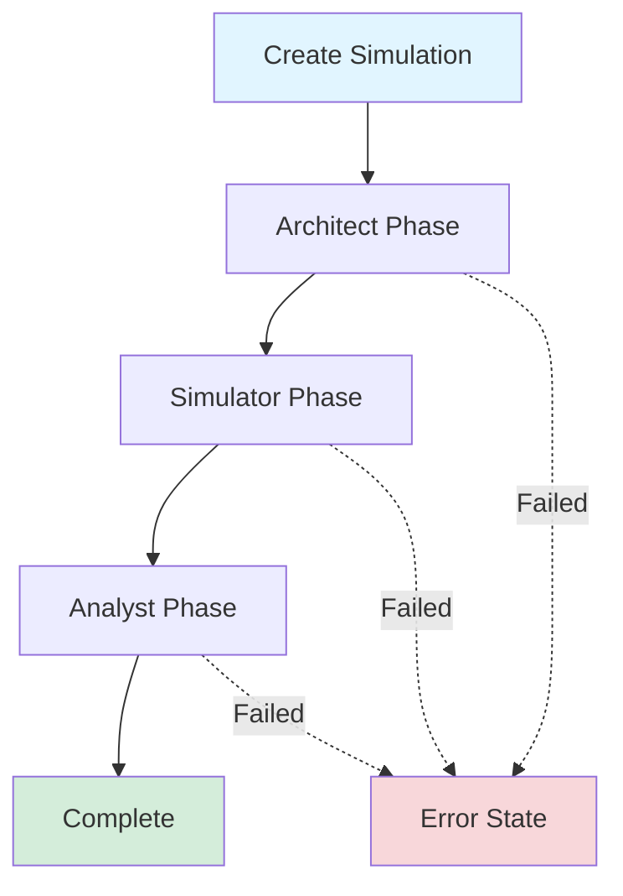
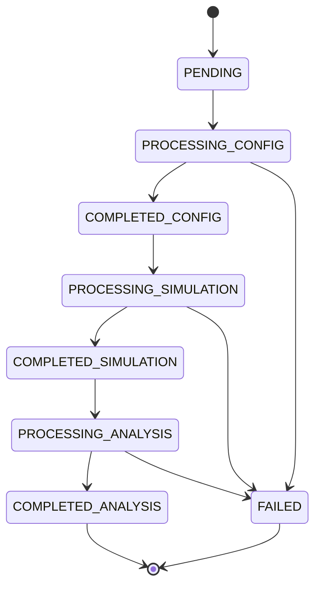

# Simulation Lifecycle

Understand how simulations progress through the three-stage pipeline.

## Overview

Every Twyn simulation goes through three phases:



## Phase 1: Architect (1-2 minutes)

**Purpose:** Design the simulation configuration

**What happens:**
1. Parses your natural language prompt
2. Identifies relevant agent groups
3. Defines variables for each group
4. Specifies actions agents can take
5. Determines time frame and step unit
6. Validates the configuration

**Status progression:**
- `PENDING` → `PROCESSING_CONFIG` → `COMPLETED_CONFIG`

**Output:** Simulation configuration

**Example:** For prompt "Simulate price increase impact on churn":
- **Agent Groups:** Customers (SMB, Enterprise)
- **Variables:** satisfaction, price_sensitivity, contract_length
- **Actions:** churn, upgrade, downgrade
- **Time Frame:** 24 weeks

## Phase 2: Simulator (2-4 minutes)

**Purpose:** Run the agent-based simulation

**What happens:**
1. Initializes agents with variables from config
2. Steps through each time period
3. Agents make decisions based on their state
4. System updates agent variables
5. Records metrics at each step
6. Generates time-series data

**Status progression:**
- `COMPLETED_CONFIG` → `PROCESSING_SIMULATION` → `COMPLETED_SIMULATION`

**Output:** Time-series metrics for all agent groups

**Example data:**
```json
{
  "step": 5,
  "variables": {
    "satisfaction": 0.68
  },
  "actions": {
    "churn": 0.05
  }
}
```

## Phase 3: Analyst (1-2 minutes)

**Purpose:** Analyze results and generate insights

**What happens:**
1. Reviews simulation data
2. Identifies key patterns and drivers
3. Flags risks and opportunities
4. Generates actionable recommendations
5. Produces executive summary
6. Creates full markdown report

**Status progression:**
- `COMPLETED_SIMULATION` → `PROCESSING_ANALYSIS` → `COMPLETED_ANALYSIS`

**Output:** Analysis with summary, drivers, risks, recommendations

## Complete Status Flow



## Timeline

| Phase | Duration | What You See |
|-------|----------|--------------|
| Architect | 1-2 min | Config generation progress |
| Simulator | 2-4 min | Step-by-step simulation |
| Analyst | 1-2 min | Analysis generation |
| **Total** | **4-8 min** | Complete insights |

## Interacting with Each Phase

### After Architect

You can:
- ✅ Review the generated config
- ✅ Edit the config
- ✅ Re-run Architect with different params
- ✅ Cancel and start over

### After Simulator

You can:
- ✅ View the raw simulation data
- ✅ Access metrics timeline
- ❌ Can't edit (would require full re-run)

### After Analyst

You can:
- ✅ View complete results
- ✅ Re-run Analyst only (future feature)
- ✅ Download full report

## Error Handling

### Architect Failures

**Common causes:**
- Prompt too vague or contradictory
- Unsupported scenario type
- Configuration validation failure

**Recovery:**
- Refine your prompt
- Add more specific details
- Try again with clearer context

### Simulator Failures

**Common causes:**
- Invalid configuration
- System resource constraints
- Numerical instability

**Recovery:**
- Review config for errors
- Simplify agent groups or variables
- Contact support if persistent

### Analyst Failures

**Common causes:**
- Insufficient data
- Analysis timeout
- System error

**Recovery:**
- Usually safe to retry
- Check simulation data quality
- Contact support with simulation ID

## Best Practices

### Do's ✅

- **Wait for COMPLETED_ANALYSIS** before fetching results
- **Check lifecycle transitions** to estimate progress
- **Handle FAILED status** gracefully with retries
- **Save simulation IDs** for later retrieval

### Don'ts ❌

- **Don't fetch results too early** (will get 409)
- **Don't poll faster than 5 seconds** per status check
- **Don't assume instant completion** - allow 10 minutes
- **Don't ignore error_log** on failures

## Monitoring Progress

Track progress through lifecycle transitions:

```python
def print_progress(simulation_data):
    """Pretty print simulation progress"""
    lifecycle = simulation_data.get('lifecycle', {})
    states = lifecycle.get('states', [])
    
    print("\n=== Simulation Progress ===")
    for state in states:
        name = state['name']
        timestamp = state['at']
        print(f"✓ {name} at {timestamp}")
    
    current_status = simulation_data['status']
    if current_status not in ['COMPLETED_ANALYSIS', 'FAILED']:
        print(f"⏳ Currently: {current_status}")
```

## Next Steps

- [Status States](./status-states) - Detailed status reference
- [Data Models](./data-models) - Understanding the data structure
- [Creating Simulations](../guides/create-simulation) - Put it into practice

