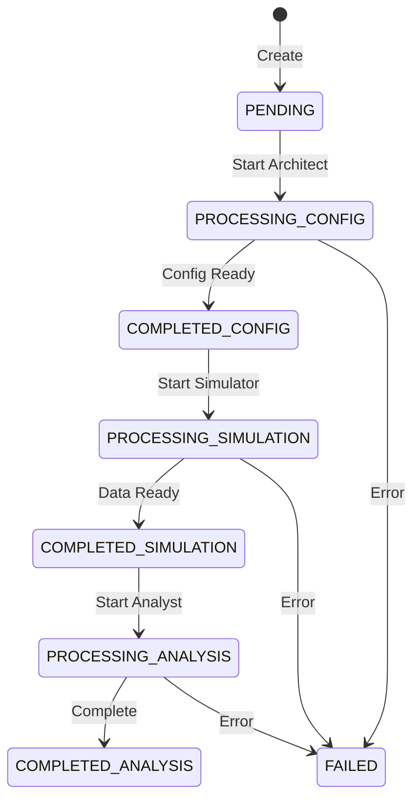

# Status States

Complete reference for all simulation status values.

## Status Enum

| Status | Meaning | Duration |
|--------|---------|----------|
| `PENDING` | Created, not yet processing | < 1 second |
| `PROCESSING_CONFIG` | Architect is working | 1-2 minutes |
| `COMPLETED_CONFIG` | Config ready | Instant |
| `PROCESSING_SIMULATION` | Simulator is running | 2-4 minutes |
| `COMPLETED_SIMULATION` | Simulation complete | Instant |
| `PROCESSING_ANALYSIS` | Analyst is analyzing | 1-2 minutes |
| `COMPLETED_ANALYSIS` | **Complete** ✅ | Final state |
| `FAILED` | Error occurred ❌ | Final state |

## State Machine



## What's Available at Each Status

| Status | Config | Data | Analysis |
|--------|--------|------|----------|
| PENDING | ❌ | ❌ | ❌ |
| PROCESSING_CONFIG | ⏳ | ❌ | ❌ |
| COMPLETED_CONFIG | ✅ | ❌ | ❌ |
| PROCESSING_SIMULATION | ✅ | ⏳ | ❌ |
| COMPLETED_SIMULATION | ✅ | ✅ | ❌ |
| PROCESSING_ANALYSIS | ✅ | ✅ | ⏳ |
| COMPLETED_ANALYSIS | ✅ | ✅ | ✅ |
| FAILED | Partial | Partial | ❌ |

## Status Checks

### Simple Check

```python
if simulation['status'] == 'COMPLETED_ANALYSIS':
    # Ready to fetch results
    results = get_results(simulation['id'])
```

### Phase Detection

```python
def get_current_phase(status):
    """Determine which phase simulation is in"""
    if status in ['PENDING', 'PROCESSING_CONFIG', 'COMPLETED_CONFIG']:
        return 'architect'
    elif status in ['PROCESSING_SIMULATION', 'COMPLETED_SIMULATION']:
        return 'simulator'
    elif status in ['PROCESSING_ANALYSIS', 'COMPLETED_ANALYSIS']:
        return 'analyst'
    elif status == 'FAILED':
        return 'failed'
    return 'unknown'
```

### Progress Percentage

```python
def calculate_progress(status):
    """Estimate progress percentage"""
    progress_map = {
        'PENDING': 0,
        'PROCESSING_CONFIG': 10,
        'COMPLETED_CONFIG': 25,
        'PROCESSING_SIMULATION': 50,
        'COMPLETED_SIMULATION': 75,
        'PROCESSING_ANALYSIS': 90,
        'COMPLETED_ANALYSIS': 100,
        'FAILED': 0
    }
    return progress_map.get(status, 0)
```

## Lifecycle Transitions

Track all state changes with timestamps:

```json
{
  "lifecycle": {
    "states": [
      {"name": "PENDING", "at": "2025-11-24T01:00:00Z"},
      {"name": "PROCESSING_CONFIG", "at": "2025-11-24T01:00:01Z"},
      {"name": "COMPLETED_CONFIG", "at": "2025-11-24T01:01:30Z"},
      {"name": "PROCESSING_SIMULATION", "at": "2025-11-24T01:01:31Z"},
      {"name": "COMPLETED_SIMULATION", "at": "2025-11-24T01:04:15Z"},
      {"name": "PROCESSING_ANALYSIS", "at": "2025-11-24T01:04:16Z"},
      {"name": "COMPLETED_ANALYSIS", "at": "2025-11-24T01:05:45Z"}
    ]
  }
}
```

### Calculating Duration

```python
from datetime import datetime

def calculate_phase_duration(lifecycle, phase_start, phase_end):
    """Calculate duration between two phases"""
    states = {s['name']: s['at'] for s in lifecycle['states']}
    
    if phase_start not in states or phase_end not in states:
        return None
    
    start = datetime.fromisoformat(states[phase_start].replace('Z', '+00:00'))
    end = datetime.fromisoformat(states[phase_end].replace('Z', '+00:00'))
    
    duration = (end - start).total_seconds()
    return duration

# Example: How long did the simulator take?
duration = calculate_phase_duration(
    lifecycle,
    'PROCESSING_SIMULATION',
    'COMPLETED_SIMULATION'
)
print(f'Simulator took {duration} seconds')
```

## Handling FAILED Status

When status is `FAILED`, check the `error_log`:

```python
def handle_failed_simulation(simulation):
    """Handle failed simulation"""
    error_log = simulation.get('error_log', 'Unknown error')
    status = simulation['status']
    
    print(f'Simulation failed at {status}')
    print(f'Error: {error_log}')
    
    # Determine if retryable
    retryable_errors = [
        'timeout',
        'temporary',
        'rate limit'
    ]
    
    is_retryable = any(err in error_log.lower() for err in retryable_errors)
    
    if is_retryable:
        print('Error may be temporary - consider retrying')
    else:
        print('Error likely requires prompt/config changes')
    
    return is_retryable
```

## Next Steps

- [Data Models](./data-models)
- [Simulation Lifecycle](./simulation-lifecycle)

