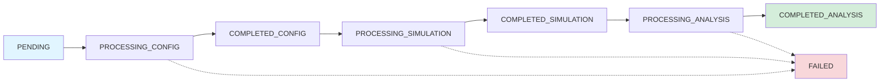

# Creating Simulations

Learn how to create simulations with different options and configurations.

## Basic Simulation

The simplest way to create a simulation is with just a prompt:

```bash
curl -X POST https://api.twyn.it/v1/simulations \
  -H "X-API-Key: your_api_key_here" \
  -H "Content-Type: application/json" \
  -d '{
    "prompt": "Simulate the impact of a 15% price increase on customer churn"
  }'
```

The Architect will automatically:
- Design appropriate agent groups
- Define relevant variables and actions
- Set a reasonable time frame
- Configure simulation parameters

## With Title and Tags

Add metadata for better organization:

```bash
curl -X POST https://api.twyn.it/v1/simulations \
  -H "X-API-Key: your_api_key_here" \
  -H "Content-Type: application/json" \
  -d '{
    "prompt": "Simulate 15% price increase impact on churn",
    "title": "Q4 Pricing Strategy Analysis",
    "tags": ["pricing", "churn", "q4-2025"]
  }'
```

**Benefits:**
- **Title**: Human-readable name (auto-generated if omitted)
- **Tags**: Filter and organize simulations later

## With Scenario

Group related simulations into scenarios:

```bash
# First, create a scenario
curl -X POST https://api.twyn.it/v1/scenarios \
  -H "X-API-Key: your_api_key_here" \
  -H "Content-Type: application/json" \
  -d '{
    "name": "Q4 2025 Pricing Tests",
    "description": "Testing various pricing strategies"
  }'

# Use the scenario_id in your simulation
curl -X POST https://api.twyn.it/v1/simulations \
  -H "X-API-Key: your_api_key_here" \
  -H "Content-Type: application/json" \
  -d '{
    "prompt": "Simulate 15% price increase",
    "scenario_id": "550e8400-e29b-41d4-a716-446655440000"
  }'
```

## With Custom Metadata

Add arbitrary metadata for tracking:

```bash
curl -X POST https://api.twyn.it/v1/simulations \
  -H "X-API-Key: your_api_key_here" \
  -H "Content-Type: application/json" \
  -d '{
    "prompt": "Simulate price increase",
    "metadata": {
      "department": "revenue",
      "analyst": "john@company.com",
      "jira_ticket": "PRICING-123",
      "experiment_id": "exp_456"
    }
  }'
```

## With Pre-Defined Configuration

Skip the Architect phase with a custom configuration:

```bash
curl -X POST https://api.twyn.it/v1/simulations/with-config \
  -H "X-API-Key: your_api_key_here" \
  -H "Content-Type: application/json" \
  -d '{
    "prompt": "Reference prompt",
    "title": "Custom Config Simulation",
    "config": {
      "step_unit": "week",
      "number_of_steps": 24,
      "agent_groups": [
        {
          "id": "customers",
          "name": "Customers",
          "description": "SaaS customers",
          "number_of_agents": 1000,
          "variables": {
            "satisfaction": {
              "type": "normal",
              "mean": 0.75,
              "std": 0.15
            },
            "price_sensitivity": {
              "type": "uniform",
              "min": 0.3,
              "max": 0.9
            }
          },
          "actions": {
            "churn": {
              "type": "binary",
              "description": "Customer cancels subscription"
            }
          }
        }
      ]
    }
  }'
```

**Use cases:**
- Reusing proven configurations
- Fine-tuning after Architect runs
- Importing configurations from templates

## Writing Effective Prompts

### Be Specific

❌ **Vague:** "Simulate customer behavior"

✅ **Better:** "Simulate customer churn from a 15% SaaS price increase across 1000 B2B customers over 6 months"

### Include Context

✅ **Good prompt structure:**
```
"Simulate [what you want to test]
for [who/what population]
with [key variables/constraints]
over [time period]"
```

### Examples

**Pricing:**
```
"Simulate the impact of a 20% price increase on customer churn
for a SaaS product with 5000 customers (70% SMB, 30% Enterprise)
considering customer satisfaction and contract length
over 12 months"
```

**Product Launch:**
```
"Simulate market adoption of a new productivity app
targeting remote workers aged 25-45
with network effects and competitor responses
over 24 months"
```

**Organizational Change:**
```
"Simulate employee turnover from switching to a 4-day work week
across 500 employees in tech, sales, and operations departments
considering morale, productivity, and external job offers
over 52 weeks"
```

## Monitoring Simulation Progress

### Checking Status

Poll the simulation status:

```bash
curl https://api.twyn.it/v1/simulations/{id} \
  -H "X-API-Key: your_api_key_here"
```

**Lifecycle states:**



### Typical Timeline

- **Architect**: 1-2 minutes
- **Simulator**: 2-4 minutes (depends on complexity)
- **Analyst**: 1-2 minutes
- **Total**: 4-8 minutes average

### Polling Pattern

```python
import time
import requests

def wait_for_completion(simulation_id, api_key):
    while True:
        response = requests.get(
            f'https://api.twyn.it/v1/simulations/{simulation_id}',
            headers={'X-API-Key': api_key}
        )
        
        data = response.json()
        status = data['status']
        
        print(f'Status: {status}')
        
        if status == 'COMPLETED_ANALYSIS':
            print('✅ Complete!')
            return data
        elif status == 'FAILED':
            print('❌ Failed')
            print(data.get('error_log'))
            return None
        
        time.sleep(5)  # Poll every 5 seconds
```

## Retrieving Results

Once `status == 'COMPLETED_ANALYSIS'`, fetch the full results:

```bash
curl https://api.twyn.it/v1/simulations/{id}/results \
  -H "X-API-Key: your_api_key_here"
```

**Response includes:**
- `config`: The simulation configuration used
- `metrics`: Time-series data for all agent groups
- `analysis`: Executive summary, key drivers, risks, recommendations

## Complete Workflow Example

```python
import requests
import time

API_KEY = 'your_api_key_here'
API_URL = 'https://api.twyn.it/v1'

headers = {
    'X-API-Key': API_KEY,
    'Content-Type': 'application/json'
}

# 1. Create simulation
print('Creating simulation...')
response = requests.post(
    f'{API_URL}/simulations',
    headers=headers,
    json={
        'prompt': 'Simulate 15% price increase impact on churn',
        'title': 'Q4 Pricing Analysis',
        'tags': ['pricing', 'churn']
    }
)

simulation = response.json()
sim_id = simulation['id']
print(f'Created: {sim_id}')

# 2. Wait for completion
print('Waiting for completion...')
while True:
    response = requests.get(
        f'{API_URL}/simulations/{sim_id}',
        headers=headers
    )
    
    status_data = response.json()
    status = status_data['status']
    print(f'  Status: {status}')
    
    if status == 'COMPLETED_ANALYSIS':
        break
    elif status == 'FAILED':
        print('Simulation failed!')
        exit(1)
    
    time.sleep(5)

# 3. Get results
print('Fetching results...')
response = requests.get(
    f'{API_URL}/simulations/{sim_id}/results',
    headers=headers
)

results = response.json()

# 4. Display insights
analysis = results['analysis']
print('\n=== ANALYSIS ===')
print(f'\nSummary: {analysis["executive_summary"]}')

print('\nKey Drivers:')
for driver in analysis['key_drivers']:
    print(f'  • {driver}')

print('\nRecommendations:')
for rec in analysis['recommendations']:
    print(f'  • {rec}')
```

## Best Practices

### Do's ✅

- **Write clear, specific prompts** with context
- **Use tags** to organize simulations
- **Group related sims** in scenarios
- **Poll every 5 seconds** - not more frequently
- **Handle FAILED status** gracefully
- **Store simulation IDs** for later retrieval

### Don'ts ❌

- **Don't use vague prompts** - be specific
- **Don't poll faster than 1 second** - respect the system
- **Don't assume instant results** - simulations take 4-8 minutes
- **Don't ignore errors** - check error_log on FAILED status

## Troubleshooting

### Simulation Stuck in PROCESSING_*

**Normal:** Simulations can take 4-8 minutes
**Action:** Wait up to 10 minutes
**If still stuck:** Contact support with simulation ID

### Simulation Failed

Check the `error_log` field:

```bash
curl https://api.twyn.it/v1/simulations/{id} \
  -H "X-API-Key: your_api_key_here"
```

Common causes:
- Invalid prompt (too vague or contradictory)
- System error (retry with same prompt)
- Configuration error (if using custom config)

### 409 Conflict When Fetching Results

The simulation hasn't completed yet. Check status and wait for `COMPLETED_ANALYSIS`.

## Next Steps

- [Polling for Results](./polling-results) - Advanced polling patterns
- [Managing Scenarios](./managing-scenarios) - Organize simulations
- [Config Management](./config-management) - Customize configurations
- [API Reference](/docs/api-reference) - Complete endpoint docs

