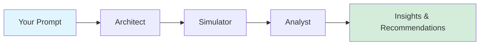

# Welcome to Twyn API Documentation

Build powerful agent-based simulations with natural language.

## What is Twyn?

Twyn is an **agent-based simulation platform** that transforms natural language prompts into actionable insights. Our three-stage pipeline—**Architect**, **Simulator**, and **Analyst**—takes your business questions and simulates complex scenarios involving thousands of agents.

### Use Cases

- **Pricing Strategy**: Simulate customer response to price changes
- **Product Launches**: Model market adoption and competitive dynamics  
- **Organizational Change**: Predict employee behavior and organizational impact
- **Market Dynamics**: Simulate supply and demand under various conditions
- **Risk Assessment**: Model cascading effects and systemic risks

## How It Works



1. **Architect**: Interprets your prompt and designs the simulation configuration
2. **Simulator**: Runs the agent-based simulation over multiple time steps
3. **Analyst**: Analyzes results and provides actionable recommendations

## Quick Start

Get up and running in 5 minutes:

1. **Get an API Key** from your [dashboard](https://twyn.it/api-keys)
2. **Create your first simulation**:

```bash
curl -X POST https://api.twyn.it/v1/simulations \
  -H "X-API-Key: your_api_key_here" \
  -H "Content-Type: application/json" \
  -d '{
    "prompt": "Simulate 10% price increase impact on customer churn"
  }'
```

3. **Poll for results** using the simulation ID
4. **Analyze the insights** including metrics and recommendations

👉 Continue to [Quickstart Guide](./getting-started/quickstart) for a complete walkthrough.

## API Overview

The Twyn V1 API provides:

- ✅ **RESTful Interface**: Standard HTTP methods and status codes
- 🔐 **Secure Authentication**: API key-based authentication with tenant isolation
- 📊 **Comprehensive Results**: Configuration, metrics, and analysis in one place
- 🏷️ **Organization**: Scenarios for grouping related simulations
- 🔧 **Customization**: Edit configurations before and after architect phase
- 📈 **Pagination & Filtering**: Efficiently query your simulation history

## Key Concepts

Before diving in, familiarize yourself with these core concepts:

- **Simulation**: A complete run through the Architect → Simulator → Analyst pipeline
- **Agent Groups**: Collections of similar agents with shared variables and actions
- **Variables**: Agent properties that can change over time (e.g., satisfaction, budget)
- **Actions**: Decisions agents can make (e.g., purchase, churn, upgrade)
- **Scenarios**: Folders for organizing related simulations
- **Status**: Lifecycle state of a simulation (PENDING, PROCESSING_CONFIG, COMPLETED_ANALYSIS, etc.)

👉 Learn more in [Concepts](./concepts/simulation-lifecycle)

## Support & Resources

- 📚 [API Reference](/docs/api-reference) - Complete endpoint documentation
- 💬 [GitHub Issues](https://github.com/twyn/twyn) - Report bugs or request features
- 📧 [Support](mailto:support@twyn.it) - Get help from our team
- 🎯 [Dashboard](https://twyn.it) - Manage your account and API keys

## What's Next?

<div className="row">
  <div className="col col--6">
    <div className="card">
      <div className="card__header">
        <h3>🚀 Getting Started</h3>
      </div>
      <div className="card__body">
        <p>New to Twyn? Start here to create your first simulation.</p>
      </div>
      <div className="card__footer">
        <a href="./getting-started/quickstart" className="button button--primary button--block">View Quickstart</a>
      </div>
    </div>
  </div>
  <div className="col col--6">
    <div className="card">
      <div className="card__header">
        <h3>🔌 API Reference</h3>
      </div>
      <div className="card__body">
        <p>Explore all available endpoints with interactive examples.</p>
      </div>
      <div className="card__footer">
        <a href="/docs/api-reference" className="button button--secondary button--block">Browse API</a>
      </div>
    </div>
  </div>
</div>
